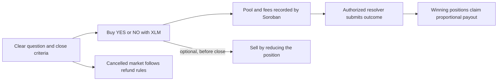

# Augora


**A Soroban prediction-market prototype for taking a position on a question and inspecting how it settles.** Built on Stellar, the project combines XLM pools, wallet-signed transactions, and contract-enforced payout accounting.

## Table of Contents

- [How it uses Stellar](#how-it-uses-stellar)
- [Why Augora](#why-augora)
- [Market flow](#market-flow)
- [How a market works](#how-a-market-works)
- [What is implemented](#what-is-implemented)
- [Deployment status](#deployment-status)
- [Prerequisites](#prerequisites)
- [Run the browser app](#run-the-browser-app)
- [Contracts and checks](#contracts-and-checks)
- [Roadmap and contributor opportunities](#roadmap-and-contributor-opportunities)
- [Environment variables](#environment-variables)
- [Security, data, and license](#security-data-and-license)

## How it uses Stellar

Augora is built on **Stellar** and **Soroban**: market pools, positions, and settlement are enforced by Soroban smart-contract logic, while wallets authorize every transaction through Stellar. The static frontend reads public Stellar (Horizon) and XLM price data and never holds keys.

## Why Augora

A poll records what people think. A prediction market records a position against a defined outcome and settles it under published rules. Augora explores how to make that lifecycle understandable and inspectable: what question is being asked, how much value entered the pool, who can resolve the market, and how the final payout was calculated.

The project is aimed at communities and builders who want a transparent way to aggregate forecasts around ecosystem milestones, public data, or other questions with verifiable resolution criteria. The prototype uses Soroban contracts for the value-bearing rules and Stellar wallets for user authorization. Its goal is to make market mechanics reviewable in code and on the public ledger, while keeping the product honest about what is live and what is still a concept.

## Market flow



The contract enforces pool accounting and settlement, while the wallet authorizes each transaction. Market questions, criteria, and resolver authority remain essential parts of the trust model.

## How a market works

1. **Create a clear question.** A market needs an outcome that can be checked against stated criteria and a close time. Resolution sources and criteria must be published before a market opens.
2. **Buy a position.** A participant chooses YES or NO and stakes XLM. The contract records the position and accounts for the market's fee shares.
3. **Sell or reduce a position.** Before close, a participant can reduce their existing stake. The `reduce_position` contract operation returns the amount computed by its accounting rules. This is not an order-book sale to another user and does not open a short position.
4. **Resolve and settle.** An authorized resolver submits the outcome. Winning positions share the distributable pool proportionally; a cancelled market follows its refund path. Contract calls and resulting transactions can be inspected on Stellar.

Market resolution is currently permissioned. Public price and network feeds shown by the website provide context; they do not act as automated oracles or trigger settlement. Resolver accountability, objective criteria, and public evidence are open product and governance problems, not solved features.

## What is implemented

- **Prediction market contract:** market creation, YES/NO positions, partial position reduction, proportional claims, cancellation refunds, per-market fee accounting, dispute timing, and administrative controls.
- **Reward asset contract:** a Soroban token used by the reward system. Fresh deployments initialize it as **Augora (AUGORA)**. The AUGORA contract has not yet been deployed.
- **Referral registry:** referral registration and bounded referral-fee distribution.
- **Leaderboard:** participant scores, win/loss records, and authorized reward minting.
- **Cross-contract tests:** accounting and behavior checks that exercise interactions across the market, referral, leaderboard, and reward asset contracts.
- **Browser prototype:** static HTML, CSS, and JavaScript; Freighter wallet connection; Testnet transaction construction, signing, submission, confirmation polling, and explorer links. Buy and reduce-position calls are implemented in the client, but the configured market is expired and cannot currently accept either action.
- **Market and leaderboard pages:** product concepts with sample values explicitly marked as illustrative; they are not currently backed by live contract reads.

The Rust workspace is maintained in the separate [`augora-contracts` repository](https://github.com/Augora-Labs/augora-contracts). Its [contract README](https://github.com/Augora-Labs/augora-contracts/blob/main/README.md) explains the workspace, and the [invariant matrix](https://github.com/Augora-Labs/augora-contracts/blob/main/INVARIANT_MATRIX.md) documents safety properties for fee, payout, referral, reward, and storage changes.

## Deployment status

These are existing pre-rebrand Testnet deployment addresses. The reward asset at its listed address retains its original identity; it is not AUGORA. Fresh deployments from the current contract source produce new addresses and initialize a new AUGORA asset.

| Contract | Testnet address | Status |
| --- | --- | --- |
| Prediction market | `CAPCAPWPGPOCENAJFYYIE22WYNFEDVZ3CT73M5MAKILFMBQ5TN2MIS6T` | Legacy deployment; configured market #3 is expired |
| Legacy reward asset | `CBYUQUXPGWUQRV7STCV3YPVLWNTFJHKLEAG7LVAOK7H4FIFJGZW5P476` | Pre-rebrand asset; not AUGORA |
| Referral registry | `CCKVUVYXR6FBB4VFYGDF3IDDUVBRJGKPDDRABTZYKI2LKAJNVLF3TTQ2` | Existing Testnet deployment |
| Leaderboard | `CCMNYMUI4XMDBTTMM7E6KNQFF3OVKS3Q2ERJ4EVQGCLW4VQCGUGG2AQM` | Existing Testnet deployment |

Inspect the contracts and transactions on [Stellar Expert Testnet](https://stellar.expert/explorer/testnet). The browser app currently uses market #3, which was published to close on September 30, 2026. It does not yet load market terms or resolution status from Soroban. Do not treat the page's sample odds, rankings, or local demo positions as current ledger state.

## Prerequisites

| Tool | Notes |
| --- | --- |
| **Python 3** | to serve the static frontend (`python3 -m http.server`) |
| **Freighter** | browser wallet on Stellar Testnet |
| **Rust 1.91.0 + wasm32v1-none** | only for the separate contracts repo |

## Run the browser app

The app has no package manager, bundler, or build step. From the root of this repository, run:

```bash
python3 -m http.server 8080 --directory frontend
```

Open [http://localhost:8080](http://localhost:8080). To inspect wallet flows, use Freighter on Stellar Testnet and Testnet assets only; they have no mainnet value. Concept-market actions are local simulations and move no funds. The browser stores recent position activity in session storage.

## Contracts and checks

Clone the [contract repository](https://github.com/Augora-Labs/augora-contracts) separately. Install Rust 1.91.0 and the `wasm32v1-none` target, then run these commands from that repository's root:

```bash
cargo test --workspace --all-features
cargo fmt --all -- --check
cargo clippy --workspace --all-features -- -D warnings
cargo build --release --target wasm32v1-none -p prediction_market
```

The frontend CI uses Node.js 22 to validate HTML pages, local assets, and JavaScript syntax. The contract repository has its own CI workflow for checks, tests, WASM builds, and invariant tests. If you change payout math, fees, storage lifetimes, or reward flows, update the tests and invariant matrix with the implementation.

## Roadmap and contributor opportunities

The next work should make the prototype more useful and easier to evaluate:

- Read market terms, open/closed state, and user positions from Soroban rather than hard-coded frontend data.
- Re-deploy a fresh Testnet suite, publish open markets, and verify the end-to-end Buy/Sell/resolve/claim path against those deployments.
- Define resolution policies with objective criteria, evidence links, resolver disclosures, and a clear dispute process.
- Connect the catalog and leaderboard to contract state and remove illustrative numbers when live data is available.
- Improve wallet accessibility, error recovery, and mobile transaction review; then arrange an independent security review before production use.

These are roadmap areas, not a claim that corresponding Wave issues are already open. Contributors should coordinate through GitHub issues and pull requests. Keep changes scoped, add regression tests for contract behavior, and include screenshots for interface changes.

## Environment variables

Copy `.env.example` to `.env` and fill in your values (see the file for inline docs). Key groups:

| Variable group | Key variables |
| --- | --- |
| Deployment (`augora-contracts`) | `DEPLOYER_SECRET`, `SPONSOR_SECRET`, `RESOLVER_PUBLIC_KEY` |

## Security, data, and license

Never commit `.deploy.env`, secret keys, recovery phrases, wallet identities, or generated deployment output. The app asks Freighter to sign transactions and does not handle secret keys. Testnet software and assets are experimental and have no mainnet value. This project is not audited or intended for production financial use. Augora source code is licensed under MIT; bundled third-party fonts retain their own licenses and notices.
